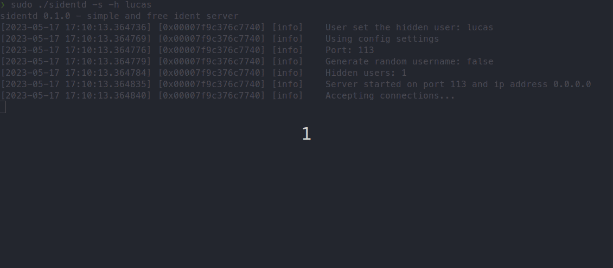

# Sidentd - an ident server

Ident is a TCP protocol developed to determine the names of the users that opened a remote
connection to a host. The RFC 1413 document that describes the protocol specification
dates back to February 1993 and is published by the US Ministry of Defense.

## building
Below are the required system packages for a successful build
* Cmake 
  * Ubuntu / Debian: sudo apt-get install cmake
* RHEL / Fedora: sudo dnf install cmake
  * libboost >= 1.58 (this was the lowest version tested)
  * Ubuntu / Debian: sudo apt-get install libboost-dev-all
  * RHEL / Fedora: sudo dnf install boost-devel
* lsof - this utility is installed by default on major Linux distributions
  * Ubuntu / Debian: sudo apt-get install lsof
  * RHEL / Fedora: sudo dnf install lsof
 
  
## testing
To test the server, the easiest way is to install an IRC client, like irssi, start sidentd and
connect to an IRC server. However, this requires that the IRC server can connect to sident
server on port 113. If that is not possible, testing can be done by using a telnet client
and writing ident requests manually.

